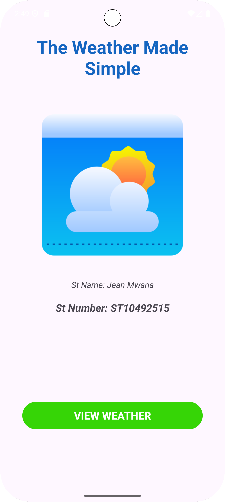
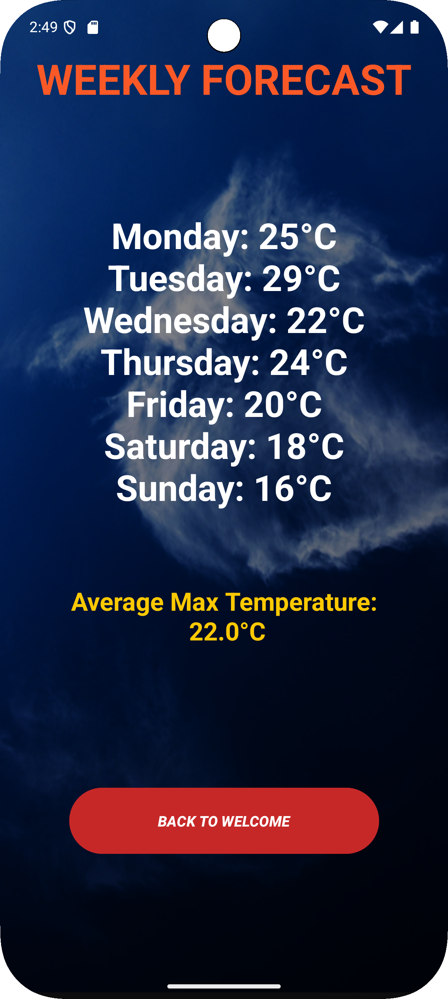

# Simple Weather App

A basic Android weather app that displays weekly temperatures.

## Features
1. **Welcome Screen**
    - App name and developer information
    - Start button to view weather

2. **Weather Display Screen**
    - Shows daily maximum temperatures

## How to Use
1. **Welcome Screen**
    - Click "View Weather" to see the weekly forecast

2. **Weather Display Screen**
    - View temperatures
    - See average temperature at bottom

## Code Structure
- **MainActivity**: Welcome screen with navigation
- **WeatherDisplayActivity**: Shows weather data and handles calculations
### Key Components
- **Parallel Arrays**: Two arrays store days, temperatures
- **While Loops**: Used for data display and average calculation
- **Intents**: Handle navigation between screens

## Screenshots
1. Welcome Screen  
   
2. Weather Display  
   

   link to the repository: https://github.com/Jeankaneki/AndroWeatherApp.git 

thanks.